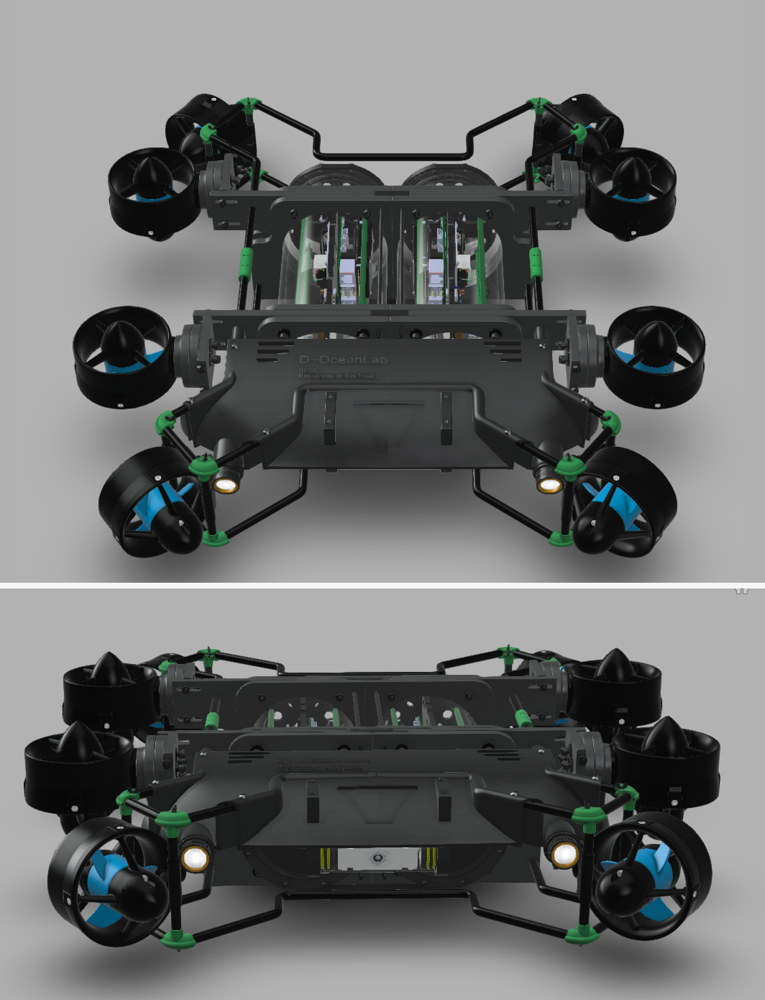

# D~OceanLab🤖

authors:
Talisma Manuel 
model v0.1

### FUNCTIONALITIES

- FISH RECOGNITION
    
    

    
    

    
- AUTONOMOUS (incoming)

  <h1 align="center">coming soon</h1>

### MECHANICAL PARTS:

  - [x]  conception de la carcasse 
    

      <!--img src="./assets/drone_full_assemble.png"        /-->
      
    

    
    - [x]  light system
    - [x]  camera tilting system
    - [x]  water proof electronic pipe
    
    
### ELECTRONICS PARTS(hardware):
   - [x]  why pixhawk as hardware
        - [x]  developer une solution du zero prendrait plus de temps et d’effort
        - [x]  solution open source et open hardware
   - [x] raspiberry pi(not too expensive)

### SOFTWARE 
    
   - [x]  environnent de développement (CI et CD → gitlab + docker + cmake + google-test + doxygen)

   - [x]  algorithme de reconnaissance real-time
        - [x]  yolov5
   
   - [ ]  tilting camera
   - [ ]  self leveling 
   - [ ]  depth hold
   - [ ]  lights
   - [ ]  inteligent battery life control
   - [ ]  déplacement autonome du robot
        - [ ]  ardusub 
