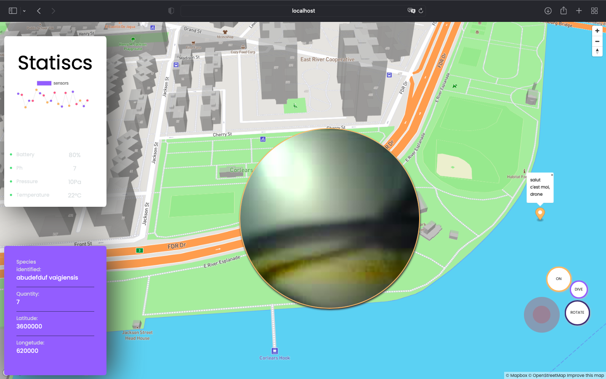
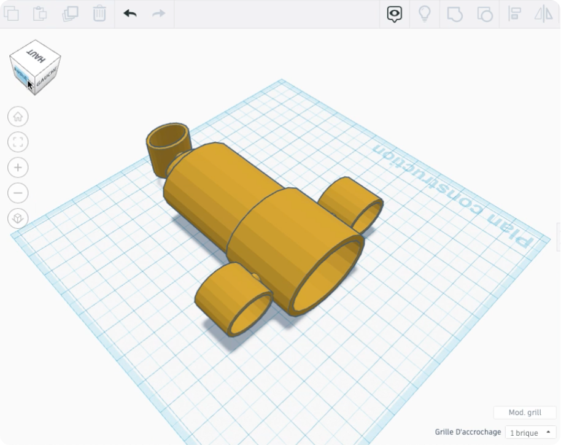
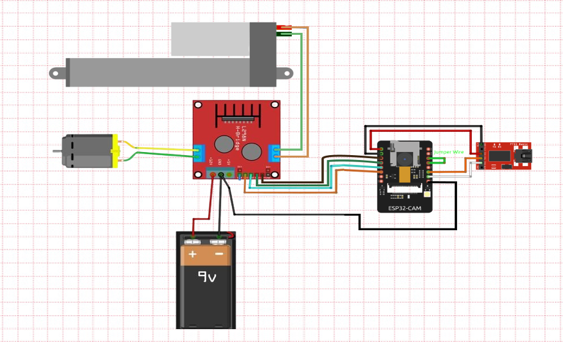
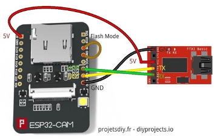
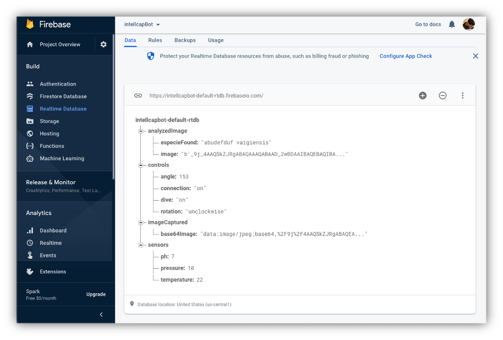

# intellCapBot🤖

authors: 
Talisma Manuel & Jeremias Bartolomeu 
v1.0
this is a stable projet version that controls the bot with:  
- ESP32 CAM 
- Node MCU 1.0V    
- Diode Rectifier - 
- 3 Hobby Motor - Gear    
- L298N Motor Driver Board Module   
- N-Channel MOSFET 60V 30A  
- 2 10K Ohm Resistor  
- Adafruit Ultimate GPS Breakout - 66 channel w/10 Hz updates - Version 3  
- DHT22/11 Humidity and Temperature Sensor  
- BreadBoard   
- Jumper Wires Pack - M/M   
- Jumper Wires Pack - M/F   

 
## Tools and technologies:

Our drone is controlled by WIFI signal, we capture the images through a camera integrated into our circuit and we visualize the images thanks to the interface.

projet interface 

For this project we chose to use the ESP8266(Node MCU 1.0V) and ESP32 microcontroller, for purely financial reasons. Associated with an OV2640 camera (2MG pixels) able to transmit in WIFI and live a video stream, images. The ESP32 is also programmable using the Arduino IDE. The two ESP choosed are also programmable using the Arduino IDE.

The three-thruster arrangement only allows forward / reverse / yaw movement, while the fourth thruster also allows for lateral translation. The five-thruster variant allows all four horizontal thrusters to push simultaneously in any horizontal direction.
In addition, placing the propellant outside the longitudinal axis of the vehicle will allow better turning moment, while providing the vehicle with high longitudinal stability.
As our misson is very simple we chose the three thruster design, so here is the architecture we chose for our drone:

 
based on **santoshsn** water drone design on tinkercad

this is how the robot circuit look like  

we still increasing features to the projets so this circuit shall be more complete with time 

we control our drone through a web browser (client side), The front-end of our web app communicates with the back-end by web socket protocol, for that we use the socket.io which is a JavaScript library for real-time web applications

this app use firebase as midleware for comunicate our robot to our server  

 

we're using mask-RCNN for classifie marines species. 

<a href="https://www.notion.so/projeto-INTELLCAP-8fc0aab3e8a24e9c8a9eb93412a3a829">chaier de charge sur NOTION</a>
