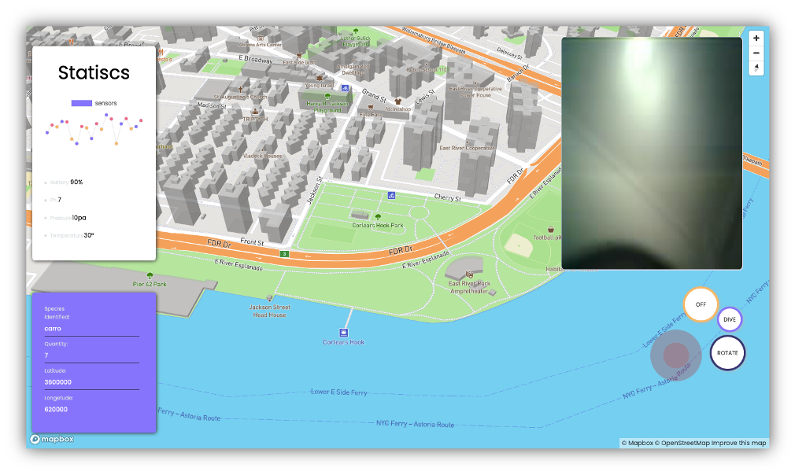
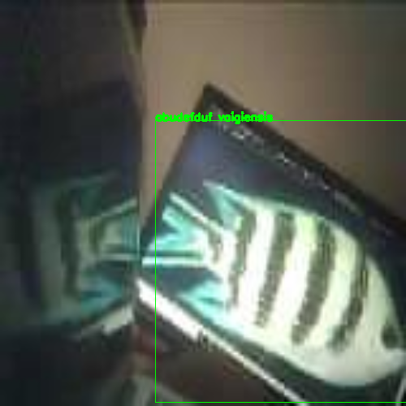

# intellCapBot🤖

authors: 
Talisma Manuel & Jeremias Bartolomeu 

we use esp32 camera to catupe photos and Convolutional neural network for analyse it 

intellcapBot is drone that works like a sumarine 
our goal is to build a robot that dive into the sea, film and recognize marine species using convolutional neural networks

<a href="https://www.notion.so/projeto-INTELLCAP-8fc0aab3e8a24e9c8a9eb93412a3a829">chaier de charge sur NOTION</a>

projet interface 

this app use firebase as midleware for comunicate our robot to our server  

this is how the robot circuit look like  
we still increasing features to the projets so this circuit shall be more complete with time 

we're using mask-RCNN for classifie marines species 
