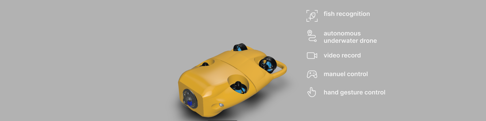
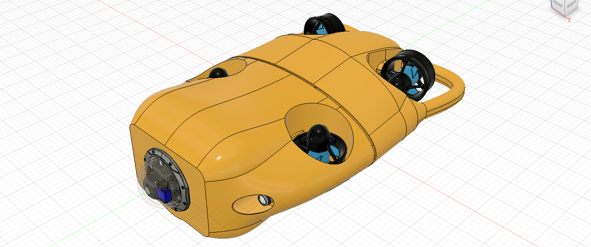
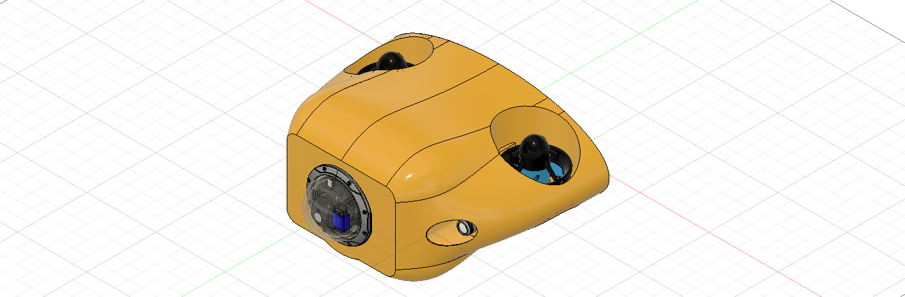
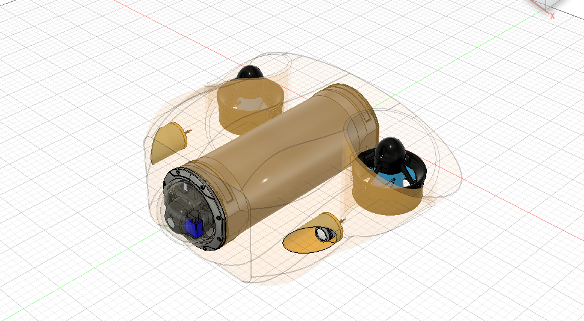

# UWDrone🤖

authors:
Talisma Manuel & Jeremias Bartolomeu 
model v0.1

### FUNCTIONALITIES

- FISH RECOGNITION
    
    

    
    

    
- AUTONOMOUS (incoming)

  <h1 align="center">coming soon</h1>

### MECHANICAL PARTS:

  - [x]  conception de la carcasse (on conçu toute la carcasse du robot sur Autodesk fusion 360)
    

      
      
      
    

 - [x]  **electronica**
    - [x]  pourquoi choisir le pixhawk comme hardware
        - [ ]  developer une solution du zero prendrait plus de temps et d’effort
        - [ ]  on a utilisé le paquet ardusub du pixhwak qui est open source
            - [ ]  fonctionnalisés du ardusub
        - [ ]  notre but était de mettre en ouvre une solution fonctionel

- [ ]  **programaçao**
    - [ ]  environnent de développement (CI et CD → gitlab + docker + cmake + google-test + doxygen)
    - criação do ambiente CID/CD, versionamento e testes automatizados
        - [x]  repositorio
        - [x]  analise estatística e dinamica
            - [x]  cppcheck
            - [x]  gnu complexity
        - [x]  estilo padronizado
            - [x]  clang-format
        - [x]  git submodule
        - [ ]  git describe
        - [x]  releases Automatica
            - [x]  como funciona
            
            as pipelines sao formada por stages que por sua vez sao por jobs
            
            os jobs precisam dum runner para rodar
            
        - [x]  cmake
        - [x]  gilab
            - [x]  gilab runner
        - [x]  doker
            - [x]  ubuntu
            
        - [x]  montar o ambiente
            - [x]  cmake
                
                compila tudo: 
                
                - [x]  o programa,
                - [x]  compila a googletest
                - [x]  o testes com googletest
            - [x]  testes com Googletest
            - [x]  Googletest com CMake
                
                a estrategia aqui é fazer um download do googletest e compila-lo com o CMake
                
            - [x]  gitlab
                - [x]  introducao
                - [x]  ci
            - [ ]  lcov (esta dando erro)
            - [x]  docker
        - [x]  gitlab registry
        - [ ]  ****Over-the-Air (OTA) Updates****
    
    pakectinzing 
    
    - [x]  algorithme de reconnaissance real-time
        - [ ]  yolov5
    - [ ]  déplacement autonome du robot
        - [ ]  ardusub rov control software(desenvolvida pela blueRobotics) é uma parte do projeto ardupilot mas feita especificamente para ROV é o mesmo firmware que roda no novo blueRov
